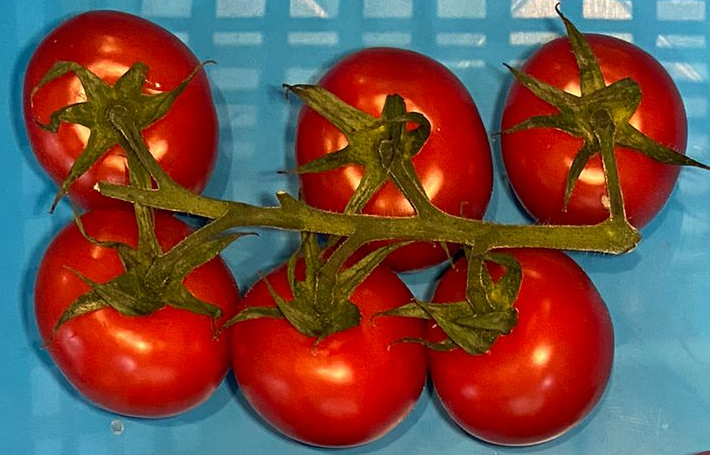

# VineFinder
VineFinder is a UNet model that can be used to find the optimal picking point for vine tomatoes for automating the picking.

The images are of various width and height and contain, in general, a single vine tomatoe: 

## Usage
To train the model, you need to download the dataset.
**TODO: Add a download link**

Run the model with the following command:
```
    python3 test.py -c configTest.json -r saved/.../model.pth
```
